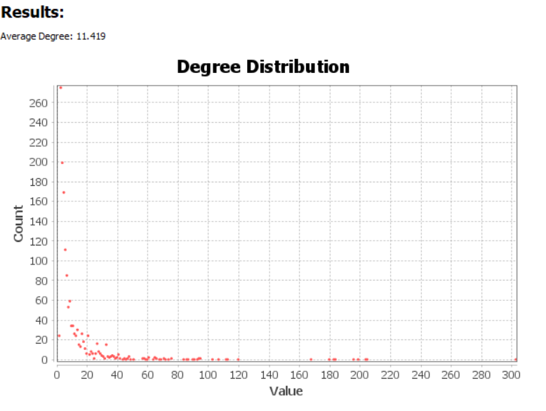

<style>
p{
    font-size:16px;
    line-height:24px;
    margin:0px 0px 12px 0px;
}

h1,h2,h3,h4,h5,h6,legend{
    font-family: Arial,Arial,Arial,sans-serif,sans-serif;
    font-weight:700;
    color: black;
}

#sidebar {
  background-color: black
}
#sidebar > h2{
  background-color: #120FD4
}
</style>

```{r setup, include=FALSE}
rm(list=ls() )
setwd("C:/Users/mrfaz/Documents/GitHub/KaggleFacebookAdTextAnalysis")
```

```{r setup, include=FALSE}
knitr::opts_chunk$set(echo = TRUE)
options(warn=-1)
```
O objetivo do presente projeto é analisar o teor político de diferentes textos utilizados como propagandas no Facebook. 

Utilizamos uma base de dados presente no Kaggle, que pode ser acessada no [link](https://www.kaggle.com/mrmorj/political-advertisements-from-facebook). Essa base foi originalmente gerada pela ONG de jornalistmo investigativo ProPublica, [página](https://projects.propublica.org/facebook-ads/), direcionada a análise desse tipo de propaganda.
Ela foi criada através da instalação de numa extensão no navegador do usuário, permitindo que ao receber uma propaganda de Marketing ela possa ser avaliada.

Os insights gerados por esse tipo de estudo podem ser úteis para que tenhamos a capacidade de compreender o que influência um usuário a classificar uma postagem como sendo de natureza política ou não política. 
Um sistema de classificação do Instituto gera uma probabilidade de que a postagem seja caracterizada como política. No nosso contexto, vamos ignorar tal informação. Consideraremos apenas os textos, as votações realizadas pelos usuários bem como a data da postagem e de atualização da propaganda).

```{r}
library(tidyverse)
library(DT)
library(tm)
library(spacyr)
library(SnowballC)
library(RDSTK)
library(wordcloud)
library(stringi)
library(RColorBrewer)
library(textstem)
library(rmdformats)

df_ads <- read_csv('fbpac-ads-en-US.csv')
print(colnames(df_ads))
```

A tabela contém uma grande quantidade de informações e ocupa $3 GB$ de memória. O seu número de linhas é $162.324$:

```{r}
nrow(df_ads)
```

Precisamos reduzir a quantidade de informações que iremos trabalhar, sem que isso signifique uma perda em nosso poder de análise. Para descobrir como filtrar a tabela de maneira adequada, precisamos, antes de iniciarmos, efetivamente, a análise dos textos, explorar os dados básicos e determinar um procedimento coerente de amostragem.

# Análise Exploratória Básica de Dados

Iniciaremos filtrando apenas as nossas colunas de interesse:
```{r}
cols_list <- c('id', 'title', 'message', 'political', 'not_political', 'created_at', 'updated_at')
df_ads <- df_ads %>% select(one_of(cols_list))
datatable(df_ads %>% head(20) %>% select(-message))
```

Estamos expondo aqui todas as colunas, à exceção do texto original, pois o texto possui um extenso número de caracteres. Iniciaremos nossa análise observando a distribuição dos votos de político / não político e verificando quais instantes de tempo (datetimes) temos a nossa disposição. Iniciemos observando o histograma das datas de postagem e de update dos posts:

```{r}
df_dates <- data.frame(
  Data = c(df_ads$created_at, df_ads$updated_at),
  Tipo = c(rep('Criação', nrow(df_ads)), rep('Atualização', nrow(df_ads)))
)

ggplot(df_dates, aes(x = Data, fill = Tipo)) + 
  geom_histogram(color = 'black', position = 'dodge') + 
  theme(text = element_text(size = 14)) +
  ylab('Contagem') + ggtitle('Distribuição de Postagens no Tempo')
```

Podemos observar que a distribuição das atualizações e criações de novos posts de propaganda são extremamente não uniformes ao longo do tempo. Além disso, tais postagems e atualizações alcançaram um grande pico no final de $2018$ e em meados de maio de $2019$. Não podemos simplesmente filtrar amostras mais recentes para reduzir nosso dataframe, pois isso implicaria em desconsiderar fenômenos relevantes que poderiam ter acontecido no período anterior ou não dar a correta dimensão das suas ocorrências. Assim, chegamos aqui à nossa primeira diretriz:

> Realizaremos uma amostragem do dataframe inicial mantendo a mesma distribuição aa data de criação. Já que os dois histogramas são similares, poderíamos também utilizar a atualização como referência sem que isso implicasse em grandes prejuízos).

Precisamos, no entanto, analisar também o teor político ou não político de nossas amostras. A princípio, traçaremos as distribuições desses parâmetros de maneira similar:

```{r}
df_votes <- data.frame(
  N.Votos = c(df_ads$political, df_ads$not_political),
  Tipo = c(rep('Político', nrow(df_ads)), rep('Não Político', nrow(df_ads)))
)

ggplot(df_votes, aes(x = N.Votos, fill = Tipo)) + 
  geom_histogram(color = 'black', position = 'dodge') + 
  theme(text = element_text(size = 14)) +
  ylab('Número de Posts') + ggtitle('Distribuição de Postagens por Votos') +
  scale_x_sqrt() + scale_y_sqrt()
```

Observam-se muitas postagens com $0$ votos tanto para "político" quanto para "não político". Porém, postagens que possuem $0$ votos tendem a ser não políticas e quanto mais votos uma postagem recebe, maior é a tendência dela ser de natureza "não política". Como estamos compararando postagens políticas com postagens não políticas, balancearemos as amostras com relação a este parâmetro. Logo:

1. Consideraremos a mesma distribuição dos dados do dataframe original no que diz respeito às datas, pois os tópicos são dinâmicos com relação ao tempo.
2. Balancearemos os posts políticos e não políticos, pois temos a intenção de diferenciar um tipo de propaganda da outra e, por isso, precisamos equilibrar as amostras para _ambos_ os casos.

Assim, nosso procedimento de amostragem consistirá em:

1. Dividir o dataframe original em dois grupos: (A) um grupo formado pelas propagandas nas quais a maior parte dos votos é político e (B) um grupo formado pelas propagandas nas quais a menor parte dos votos é não política. Não iremos considerar postagens nas quais nenhum voto foi realizado.
2. Para cada uma das amostras obtidas no passo anterior, realizaremos uma amostragem estratificada com base no tempo o qual o post foi criado.


Queremos um número pequeno de amostras para que tenhamos a capacidade computacional de processar os dados seguidamente de forma eficiente, garantindo uma análise apropriada dos fatos encontrados nos dados. A utilização integral desses dados poderia ser desejável na etapa na qual o sistema seria posto em produção. Logo, obteremos uma amostra de $4000$ linhas.

Para isso criamos uma variável de estratificação. Ela será composta por dois termos: o tipo de variável (se ela é política ou não política) e o quantil da data considerada. Em relação a data será decomposta em 10 quantis:

```{r}
df_ads_strat <- df_ads
df_ads_strat$tentile <- df_ads_strat$created_at %>% ntile(10)
df_ads_strat <- df_ads_strat %>% mutate(strat_group = tentile %>% 
  as.character %>% 
  str_c('_') %>% 
  str_c(if_else(political > not_political, 'Political', 'NotPolitical')))

df_ads_strat <- df_ads_strat %>% filter(political + not_political > 0)
df_ads_strat %>% head(10) %>% select(-one_of('message'))
```

AApós a execução, aplicaremos uma amostragem estratificada utilizando a variável "strat_group" como grupo de estratificação. Para cada grupo separadamente e para cada um deles iremos amostrar aleatoriamente $200$ variáveis. Como temos $20$ grupos ($10$ quantis para político e não político), obteremos, ao final, as $4000$ amostras que desejamos em nosso dataframe reduzido:
```{r}
id_list <- c()
for (current_strat_group in unique(df_ads_strat$strat_group)) {
  df_current_group <- df_ads_strat %>% filter(strat_group == current_strat_group)
  id_list <- c(id_list, df_current_group$id[sample.int(nrow(df_current_group), 200)])
}

df_sample_ads <- df_ads_strat %>% filter(id %in% id_list)

print('Número final de amostras:')
print(nrow(df_sample_ads))
```

Finalmente, podemos iniciar nossa análise de texto com um dataframe reduzido e que mantém as características desejadas da amostra inicial bem como um devido balanceamento de dados políticos e não políticos.

# Limpeza / Mineração de Dados

O pacote de "text mining" (TM) será utilizado pra que obtenhamos um conjunto de textos sem pontuações, números ou palavras que fogem do interesse de nossa análise (como artigos e preposições) e palavras que não possuem nenhum significado semântico. Também retiramos as tags HTML contidas no texto, possíveis acentuações e hiperlinks. Definindo as funções de limpeza de strings:

```{r}
removeHTML <- function(x) (return(gsub('<.*?>', ' ', x)))
removeURL <- function(x) (return(gsub('http[[:alnum:]]*', ' ', x)))
removeAccents <- function(x) (return(stri_trans_general(str = x, id = 'Latin-ASCII')))
removeNonAlphanum <- function(x) (return(gsub('[^[:alnum: ]]', ' ', x)))
removeEmoji <- function(x) (return(gsub("[^\x01-\x7F]", "", x)))

stop_words_list <- c(stopwords(kind = 'SMART'), 'time', 'back', 'today', 'day', 'dont')
removeSelectedWords <- function(x) (return(removeWords(x, stop_words_list)))

clean_str <- function(df_in, merge_string = TRUE) {
  
  final_cleaning <- function(x) {
    x %>% 
      tolower %>% 
      removeHTML %>% 
      removeURL %>% 
      removeAccents %>% 
      removeEmoji %>%
      removeNonAlphanum %>% 
      removeNumbers %>% 
      removeSelectedWords %>% 
      removePunctuation %>%
      str_squish %>% 
      lemmatize_words %>% return()
  }
  
  df_in_proc <- df_in %>% mutate(text = str_c(title, ' ', message))
  
  if (merge_string) {
    return(
      final_cleaning(
        paste(df_in_proc$text, collapse = ' ')))
  }
    
  return(df_in_proc$text %>% lapply(final_cleaning))
  
}
```

Definindo uma função para gerar um objeto do tipo "TermDocumentMatrix" com a realização da operação de lematização. Vale ressaltar, que preferimos a utilização da lematização em vez da stemmer, pois a lematização não realizada o truncamento por meio do radical da palavra, possibilitando um melhor entendimento das palavras contidas no contexto:

```{r}
get_tdmat <- function(str_in) {
  str_in %>% 
    VectorSource %>% 
    Corpus %>%
    TermDocumentMatrix %>%
    return()
}
```


Finalmente, definimos a função que transforma o objeto "TermDocumentMatrix" em uma matriz de frequências, que utilizaremos para gerar um WordCloud:


```{r}
get_df_words_freq <- function(tdMat) {
  counts <- sort(rowSums(as.matrix(tdMat)), decreasing = TRUE)
  counts <- counts[grepl('^[a-z]+$', names(counts))]
  frame_counts <- data.frame(word = names(counts), freq = counts)
  return(frame_counts)
}
```

```{r}
beautiful_wordcloud <- function(df_freq) {
  return(
    wordcloud(
      df_freq$word, 
      freq = df_freq$freq, 
      scale=c(2.5, 0.5), 
      random.order=FALSE, 
      max.words = 50, 
      colors = brewer.pal(8, "Dark2"),
      rot.per=0,)
  )
}
```

```{r}
word_cloud_plot_pipeline <- function(str_in) {
  str_in %>% 
    clean_str %>% 
    get_tdmat %>% 
    get_df_words_freq %>% 
    beautiful_wordcloud %>% 
    return()
}
```

```{r}
word_cloud_plot_pipeline(df_sample_ads %>% filter(political > not_political))
```

```{r}
word_cloud_plot_pipeline(df_sample_ads %>% filter(political < not_political))
```

Podemos observar que muitas propagandas políticas estão relacionadas a termos como "campanha", "trump", "votar" e "congresso". É interessante notar que o verbo "make" está também presente na WordCloud e isso muito provavelmente é devido ao fato de a palavra "make" fazer parte da campanha de Donald Trump ("Make America great again").

Com relação às postagens não políticas, a palavra "presente" parece assumir um forte papel. Assim, muitas propagandas que não são de teor político tendem a ser anúncios de presentes. Porém, além disso, palavras como "proteger", "cuidado", "emergência", "resgate" e "doação" aparecem, indicando que existem também diversos posts de propagandas não políticas relacionadas a ONG's. 

A partir dos insights aqui gerados, podemos gerar um conjunto de diferentes grafos para permitir que nossa análise de dados seja enriquecida:

* __A. Grafos de palavras "políticas" e palavras "apolíticas"__
> São os grafos mais básicos e permitirá que a gente confira como as entidades se relacionam para cada uma das duas possíveis classificações.

* __B. Grafos de Ego__
> Podemos analisar os dois casos que nos chamaram atenção - para o Wordcloud "apolítico", podemos fazer uma rede ego ao redor de "Trump" e para o wordcloud "apolítico" podemos fazer uma rede de ego ao redor de "Gift" e interpretar os resultados.

* __C. Grafos Bipartides__
> Uma outra possibilidade que propusemos é a de um grafo bipartido cujos nós relacionados a palavras se ligam a dois nós de outra partição: o nó "POLÍTICO" ou o nó "APOLÍTICO". O peso de ligação entre uma palavra e o nó "POLÍTICO" seria igual ao seu peso na tabela de frequência gerada ao plotar o Wordcloud de palavras de posts políticos e, simetricamente, o peso de ligação entre cada palavra e o nó "APOLÍTICO" seria igual ao seu peso na tabela de frequência do Wordcloud de palavras de posts não políticos.

Antes de fazermos essa análise de grafos,  classificaremos as palavras e extrairemos as entidades por meio da biblioteca SpacyR. Essa biblioteca permite que encontremos quem sãos os EVENTO, ORGANIZAÇÃO, PESSOA etc. Esse tipo de classificação pode ser especialmente útil no aprimoramento da análise de grafos - podemos, por exemplo, verificar quais EVENTOS se relacionam à palavra TRUMP ou ainda visualizar como entidades do tipo PESSOA se relacionam com entidadesdo tipo ORGANIZAÇÃO.

Assim, iremos manipular a biblioteca SpacyR na próxima seção, preliminarmente à geração dos grafos.

# Identificação de Entidades com SpacyR

Por meio da função "spacy_extract_entity" iremos classificar as entidades para o caso em que a mensagem foi classificada como política e para o caso em que a mensagem foi classificada como não política:

```{r}
spacy_initialize()

extract_entity <- function(x) (
  return (spacy_extract_entity(x %>% (function(x)(clean_str(x, FALSE)))
                                 %>% unlist)))

political_entities <- extract_entity(df_sample_ads %>% filter(political > not_political))
not_political_entities <- extract_entity(df_sample_ads %>% filter(political < not_political))

```

Temos então, para o caso de entidades políticas:

```{r}
datatable(political_entities)
```


E para o caso de entidades não políticas:

```{r}
datatable(not_political_entities)
```

Quais tipos de entidades nós temos?

```{r}
unique(c(political_entities$ent_type, not_political_entities$ent_type))
```

Podemos tentar verificar se alguns tipos de entidades são mais comuns para determinado tipo:

```{r}
df_political_hist <- political_entities %>% count('ent_type')
df_not_political_hist <- not_political_entities %>% count('ent_type')

df_political_hist$freq <- df_political_hist$freq
df_not_political_hist$freq <- df_not_political_hist$freq

df_political_hist$type <- 'Político'
df_not_political_hist$type <- 'Não Político'

rbind(df_political_hist, df_not_political_hist) -> df_entity_distrib
```

Representando esses resultados graficamente:

```{r, fig.width = 10, fig.height = 10}
ggplot(df_entity_distrib, aes(x = ent_type, y = freq, fill = type)) + 
  geom_bar(stat = 'identity', color = 'black', position = 'dodge') + 
  facet_wrap(facets = vars(ent_type), ncol = 3, scales = 'free') +
  theme_minimal()
  
```

Aqui tiramos alguns insights que julgamos interessantes:

* Eventos tendem fortemente a ocorrer em postagens que não são políticas
* Linguagem __sempre__ ou __quase sempre__ (a depender do seed) apareceu em postagens sem teor político
* O mesmo pode ser dito em relação a quantidade, percentuais e a "work of arts" (livros músicas etc.) - Isso se relaciona ao fato de postagens não políticas terem forte influência da palavra "GIFT" - Provavelmente são postagens de vendas, com valores, custos e numerais em geral
* Leis aparecem com 100% de chance (ou quase 100% de chance) em postagens de teor político (o que é, de fato, intuitivo)


Podemos listar quais desses tipos são interessantes para nossa análise:


__PERSON__: 
> Pode ser útil no contexto de identificar ligações entre pessoas no meio político

__NORP__: 
> Engloba religiões e grupos ideológicos, inclusive os de caráter político

__ORG__: 
> O estudo da relação entre as organizações pode auxiliar na análise

__LAW__:
> Leis podem ser o diferencial entre um caso e outro

__WORK OF ART__: 
> Se existe esse tipo de entidade numa publicidade, é improvável que seja de cunho político, pois engloba músicas, livros etc.

__EVENT__: 
> Eventos podem conectar pessoas e organizações. Manteremos essa entidade aqui

__PRODUCT__:
> No gráfico vimos que temos muitos produtos ligados a ambos os tipos de postagens, quais produtos se ligam a cada tipo?

É com foco nesses tipos de entidades que iniciaremos na próxima seção a plotagem dos grafos.

# Análise de Grafos

Os grafos serão gerados por meio da ferramenta Gephi. Temos que gerar as matrizes de adjacências para cada uma das situações propostas anteriormente. Antes de iniciarmos a geração de tais matrizes, iremos filtrar os tipos de entidades que serão
estudados:

```{r}
entities_to_keep <- c('PERSON', 'NORP', 'LAW', 'WORK_OF_ART', 'EVENT', 'PRODUCT')

political_entities_graph <- political_entities %>% 
  filter(ent_type %in% entities_to_keep)

not_political_entities_graph <- not_political_entities %>% 
  filter(ent_type %in% entities_to_keep)
```


# Grafos Gerais - Político X Não Político

Neste caso, duas entidades serão adjacentes sempre que pertencerem a uma mesma postagem e o peso das arestas será igual ao número de posts compartilhados por cada par de nós (entidades). De acordo com a [documentação do Gephi](https://gephi.org/users/supported-graph-formats/csv-format/), podemos simplesmente exportar um dataframe com as combinações de pares ligados e, no caso de haver mais de uma ligação, o peso da aresta será incrementado automaticamente.

```{r}

get_adj_list <- function(df_ent) {
  
  list_node1 <- c()
  list_node2 <- c()
  
  df_ents_to_read <- df_ent
  doc_list <- unique(df_ent$doc_id)
  for (current_doc in doc_list) {
    
    df_current_doc <- df_ent %>% filter(doc_id == current_doc)
    n_ent_curr_doc <- nrow(df_current_doc)
    
    if (n_ent_curr_doc > 2) {
      for (i in 1:(n_ent_curr_doc - 1)) {
        for (j in (i + 1):(n_ent_curr_doc)) {
        
          list_node1 <- c(list_node1, df_current_doc$text[[i]])
          list_node2 <- c(list_node2, df_current_doc$text[[j]])
        }
      }
    }
    # Otimizar velocidade na hora da filtragem
    df_ents_to_read <- df_ents_to_read %>% filter(doc_id != current_doc)
  }
  
  return(data.frame(node1 = list_node1, node2 = list_node2))
}

get_adj_list(political_entities) %>% write_csv(path = 'political_adj.csv')
get_adj_list(not_political_entities) %>% write_csv(path = 'not_political_adj.csv')
```

```{r}
library(gtools)
library(igraph)
# função criada pelo professor
get_adj_list2 <- function(entities, file){
  entities = lemmatize_words(entities)
  edges <- entities %>% dplyr::group_by(doc_id) %>% dplyr::summarise(entities = paste(text, collapse = ","))
  # remove duplicated for the same document
  edges <- lapply(str_split(edges$entities, ","),
  function(t){unique(unlist(t))})
  # Auxiliary functions for creating adjancnt
  get_adjacent_list <- function(edge_list) {
    adjacent_matrix <- combinations(length(edge_list),2, edge_list, repeats.allowed=TRUE)
    return(adjacent_matrix)
  }
  adjacent_matrix <- edges %>% lapply(get_adjacent_list) %>% reduce(rbind)
  
  df <- as_tibble(adjacent_matrix, colnames=c('source', 'target'))
  weighted_edgelist <- df %>% dplyr::group_by(V1, V2) %>% dplyr::summarise(weight=n())
  
  news_graph <- weighted_edgelist %>% graph_from_data_frame(directed=F)
  write_graph(news_graph, paste(file, '.graphml', sep = ""), 'graphml')
}
```


Finalmente, com esses arquivos gerados, podemos exibir nosso primeiro par de grafos. Para ambos, o procedimento adotado foi o de (1) dar aos nós e arestas tamanhos e cores variáveis de acordo com o grau de ligação, (2) aplicar o algoritmo de Force Atlas para separar os nós e (3) aplicar o algorimo de "no overlap" para separá-los, (4) aplicar um filtro para selecionar apenas os nós e arestas relativos aos maiores graus (para permitir uma boa visualização).

Para o caso político:


O grau de conexão do grafo político que pode ser avaliado por meio da sua densidade é muito baixo, em torno de 0.008. Menos de 1% das arestas.


O grau médio informa a quantidade média de entidades do grafo que estão conectas. Conforme visualização da distribuição abaixo, um nó está conectado a aproximadamente a outros 11 outros nós. Pela distribuição é possível verificar que há poucos entidades com muitas conexões e grande maioria das entidades possuem poucas conexões. Um gráfico típico de cauda longa, podemos perceber que há uma formação de hubs, que seriam nós conectados a uma grande quantidade de outros nós.


Também podemos detectar a quantidade de comunidades, para isso podemos utilizar a função estatística de modularidade que nos informará a quantidade de grupos que será criado.
Neste gráfico, o algoritmo detectou 53 grupos.


Também podemos utilizar uma outra análise por meio da métrica de centralidade betweeness para analisar quais entidades se conectam aos outros grupos.


Devido a grande quantidade de comunidade, iremos reduzir os tipos de entidades que iremos trabalhar para permitir uma análise mais aprofundada dos grupos. Logo, filtraremos as entidades pessoas e organizações para análise.

```{r}
entities_to_keep <- c('PERSON', 'ORG')

political_entities_limit <- political_entities %>% 
  filter(ent_type %in% entities_to_keep)

not_political_entities_limit <- not_political_entities %>% 
  filter(ent_type %in% entities_to_keep)

get_adj_list2(political_entities_limit,'political_adj_limit')
get_adj_list2(not_political_entities_limit,'not_political_adj_limit')
```

O grau de conexão do grafo político que pode ser avaliado por meio da sua densidade é muito baixo, em torno de 0.004. Menos de 1% das arestas comparadas a de um grafo completo estão conectadas.


O grau médio informa a quantidade média de entidades do grafo que estão conectas. Conforme visualização da distribuição abaixo, um nó está conectado a aproximadamente a outros 7.91 outros nós. Pela distribuição é possível verificar que há poucos entidades com muitas conexões e grande maioria das entidades possuem poucas conexões. Um gráfico típico de cauda longa, de mode que podemos perceber que há uma formação de hubs, que seriam nós conectados a uma grande quantidade de outros nós com poucas conexões.


Também podemos detectar a quantidade de comunidades, para isso podemos utilizar a função estatística de modularidade que nos informará a quantidade de grupos que será criado.
Neste caso, o algoritmo detectou 6 grupos.


O  grupo vermelho, azul e verde representam mais de 90% dos agrupamentos dos nós. Vamos focar na avaliação nesses grupos. Verificando quais entidades estão relacionadas em cada um dos grupos.


No grupo vermelho, a entidade que mais se destaca como popular é o "senate". Podemos perceber também que há um grupo de entidades relacionadas a membros do senado americano tais como Susan Collins, Robert Hendrick e Adam Smith. Também identificamos muitas palavras associadas ao partido republicano, isso faz sentido já que os republicanos são maioria no senado americano. Além disso, percebermos que há algumas entidades associadas ao apoio de iniciativas de exploração do espaço. 


No grupo azul, a palavra mais popular é congresso. Encontramos entidades tai como medicare, que é o sistema do governo de plano de saúde para pessoas acima de 65 anos e para pessoas com algum tipo de deficiência; Donal Trump - Presidente dos Eua e Robert Mueller que terminou seu trabalho como diretor do FBI investigando interferência russa na eleição de 2016 como procurador especial do Departamento de Justiça. Donalt Trump e Robert Mueller  se envolveram num processo de pedido de impeachment do presidente Donald Trump feito pelo congresso requisitando seu afastamento do cargo que foi posteriormente barrado no senado, o qual o presidente tem maior apoio de sua bancada.


No grupo verde percebemos uma aglomeração maior de temas relacionadas a eleição na virginia o qual o democrata Ralph Northam venceu uma disputa acirrada pelo governo do Estado norte-americano da Virgínia, causando um revés ao presidente dos Estados Unidos, Donald Trump, com uma vitória decisiva sobre um republicano que havia adotado algumas das táticas conflituosas do presidente.


Também podemos utilizar uma outra análise por meio da métrica de centralidade betweeness para analisar quais entidades se conectam aos outros grupos. Se destacam congress, senate, donalt trump, suprme court, gop(Partido republicano), medicare. Vale ressaltar que as intuições americanas se destacam nessa análise.


Para o caso não político, temos que analisar o grafo com mais paciência. Quando realizamos a plotagem do grafo, foi possível identificar a presença de "dois grandes grupos" ao organizarmos os nós por meio do algoritmo de Force Atlas:


Grafo não político

Temos um grupo superior e um inferior com nós de graus extremamente grandes conectando os dois "clusters". Podemos observar cada uma das posições. Na parte inferior temos:


E podemos observar __muitos__ casos de palavras ligados a países, dias da semana, nacionalidades e outros aspectos pouco relevantes para uma boa caracterização do que seria uma "propaganda apolítica". Porém, podemos notar que existem algumas entidades como "partido republicano" que se encontram em postagens nas quais existem mais votos a favor de "não político" e que se encontram em tais postagens com elevado grau.

Isso nos leva a concluir que palavras relacionadas ao partido republicano parecem tender a possuir um elevado número de falsos positivos no processo de classificação do tipo de postagem. Continuemos nossa análise - vamos olhar, agora, a parte superior do grafo:


Aqui podemos notar um elevado número de termos, nomes, regiões e locais de natureza latina ou relacionados ao sul dos EUA. Então, aparentemente, indivíduos (como atorese artistas) e organizações relacionadas a esses elementos tendem a, por alguma razão, serem ativos na disseminação de propagandas não políticas do Facebook.

Faremos também  a mesma abordagem das entidades políticas, filtrando somente as entidades relacionadas a pessoas e organizações, para uma anpalise mais aprofunda dos grupos.


O grupo laranja, azul e verde representam mais de 90%. Vamos focar na avaliação nesses grupos. O objetico será avaliar as entidades que estão relacionadas em cada um dos grupos.


No grupo verde a palavra que mais se destaca é o Bill Penzey que ficou famoso por misturar política e salsa, gastando mais de US $ 700.000 em anúncios no Facebook pelo impeachment de Trump. A Penzeys Spices lançou  uma mistura de cebolinha e alho sem sal para polvilhar sobre tomates, ovos mexidos e salmão. Mas, em vez de imprimir uma receita no rótulo do tempero da Justiça, o proprietário da empresa enviou uma mensagem aos seus clientes:
A Justiça é a luz que guiou a América em todas as tempestades. Agora, uma das partes quer obstruí-la, torcer, roubar do povo para presenteá-lo aos seus benfeitores. O futuro da América depende de nós não deixar isso acontecer.
 
 

No grupo azul, há diversas entidades relacionadas a políticas antitrust. A Caroline Holland, por exemplo, atualmente trabalha como bolsista de política técnica na Mozilla Foundation. Ela está explorando questões de política antitruste e de concorrência à medida que elas se relacionam.


No grupo laranja, estão a palavras mais relacionadas a política tais como republican party, sepreme court, senate. 
A entidade John McCain também se destaca. John McCain, senador americando, herói de guerra e referência da velha guarda republicana, faleceu vítima de um agressivo câncer cerebral aos 81 anos. Tinha se convertido no grande algoz de Donald Trump.
Também se destaca a entidade Wisconsin que é um dos 50 estados dos Estados Unidos, localizado na região norte do país. O Wisconsin possui um dos maiores rebanhos de gado bovino do país. 
No entanto, grande parte está relacionada a entidades políticas. Isso nos leva a concluir que o classificador de propagandas políticas e não políticas parecem tender a possuir um elevado número de falsos positivos no processo de classificação do tipo de postagem. 


Resumindo, nessa seção concluimos que:

1. Existem palavras que dão forte probabilidade de o post ser político
> Mas temos que ter cuidado! Termos ligados ao "partido republicano" parecem ser controversos nesse sentido

2. Existe um cluster de termos latinoamericanos fortemente relacionado a regiões do sul dos EUA que aparecem fortemente em postagens não políticas.

3. Podemos também notar a presença forte do termo "American" em ambos os casos. Assim, existem termos que não parecem exercer um papel relevante no processo de classificação.

Com isso, podemos prosseguir e desenhar o grafo de ego relacionado a "Donald Trump" para estudar uma das entidades mais fortemente presente no wordcloud político.

# Grafo de EGO: Utilizando a entidade "Donald Trump" como exemplo

Iremos traçar o grafo de ego relacionado a "Donal Trump" a partir do grafo geral criado na seção anterior. Efetuando os ajustes necessários no Gephi, obtemos:


Nesse caso, utilizamos uma combinação de Frutchman-Reynold com No Overlap para organizar a rede de ego de forma a deixar o termo "Donal Trump" na posição central. Também foi necessário, no Gephi, realizar um merge entre as entidades "Donald", "Trump"e "Donald Trump". Com isso, foi possível verificar, principalmente, a relação do político com as demais instituições além de termos como "medicare", "fox news" ou "bob casey" (ao pesquisar, verificamos que Bob Casey é um político do partido democrata).

Assim, foi possível obter, principalmente, a relação entre Donald Trump e outras instituições, além de tópicos abordados em possíveis debates e outros indivíduos que com ele se relacionam.

Nosso próximo passo é gerar a rede bipartide, na qual iremos ligar cada nó a "POLÍTICO" ou a "NÃO POLÍTICO", permitindo mapear de maneira mais efetiva quais palavras tendem a caracterizar determinado tipo mais fortemente e quais palavras tendem a aparecer com abundância em textos de ambas as classificações.

# Grafo Bipartide: Mapeamento de Teor Político